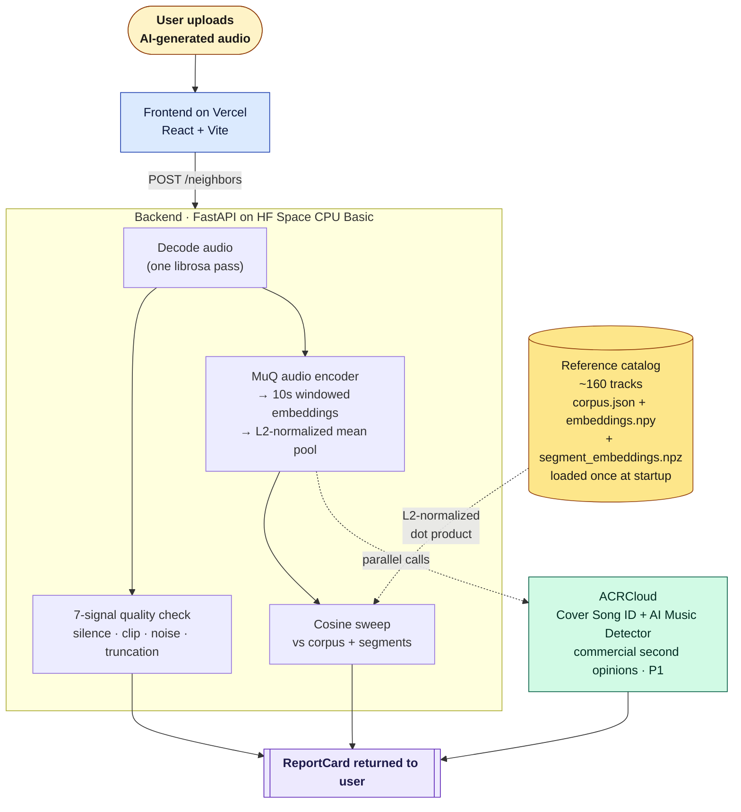

# PiedPiper

> *A creator-feedback layer for AI-generated music. Every generation passes through an originality check before it ships.*

**[Live demo →](https://piedpiper-xi.vercel.app)** &nbsp;·&nbsp; **[Backend →](https://rajata98-piedpiper.hf.space/health)** &nbsp;·&nbsp; **[Decision record →](docs/decisions/0001-similarity-calibration.md)**

PiedPiper is a deployed web app that gives creators real-time feedback on how their AI-generated music compares to existing reference tracks. Upload a Suno or Udio generation; PiedPiper encodes it with a music-tuned audio embedder, retrieves the top-3 closest neighbors from a hand-curated catalog, calibrates the similarity scores against the catalog's own pairwise-cosine distribution, and surfaces:

- A **calibrated match score** as a percentile rank with a coarse label (`very close` / `close` / `moderate` / `weak`) — not a raw cosine percentage, because raw cosine misleads on contrastive-trained encoders (see [ADR-0001](docs/decisions/0001-similarity-calibration.md)).
- **Audio previews + album art** for every match so the creator can hear the comparison, not just read it.
- A **specificity score** that flags when a generation is broadly similar to many catalog tracks vs. distinctively close to a specific one.
- Two independent **ACRCloud signals** as adjacent rows on the same report: a **Cover Song ID** check (does this resemble a known composition?) and an **AI Music Detector** verdict (is this AI-generated, and probabilistically from which engine?).
- An inline **track-quality status badge** from the inherited 7-signal librosa pipeline.

The intended product surface inside an AI music platform: this same pipeline runs on every generation before it reaches the creator. If the top match is too close, the creator gets actionable feedback — *"this generation scored close to track X. Try these prompt tweaks to push it toward more originality."* PiedPiper-the-portfolio-piece prototypes that loop end-to-end.

A separate [`/evaluation`](https://piedpiper-xi.vercel.app/evaluation) page reports measured retrieval quality on the catalog: **`Recall@1=0.639`, `Recall@3=0.735`, `MRR=0.692`**, latency `p50=0.27 ms`, and a top-1 cosine distribution. These are the post-ADR-0002 numbers after swapping LAION-CLAP for MuQ-MuLan; the LAION-CLAP baseline numbers (R@1=0.394 / R@3=0.494 / MRR=0.458) are preserved in [ADR-0002](docs/decisions/0002-swap-clap-for-muq-mulan.md) so the swap's empirical justification stays auditable. Leave-one-out methodology — honest about what it tests and what it doesn't.

## A small note on the name

In the *Silicon Valley* pilot ("Minimum Viable Product"), Richard Hendricks first pitches Pied Piper as a music app — a tool for songwriters and composers to search whether their melody resembles anything that's come before. The investors laugh him out of the room and the show pivots Pied Piper to a compression algorithm. **PiedPiper-the-project is Richard's original pitch, ten years later, applied to AI-generated music.** The engineering is straight; the framing is a wink.

## Architecture



One decode pass feeds three jobs in parallel: a 7-signal quality check (the inherited broken-output detector), the MuQ windowed encoder, and the optional ACRCloud calls. All three results merge into a single ReportCard.

The catalog is built offline by `python -m backend.scripts.rebuild_corpus`, which reads `backend/catalog.yaml`, hits the iTunes Search API (Tier 1) and Jamendo CDN (Tier 2), runs windowed MuQ encoding on every track, and writes five files to `quality-scorer/public/corpus/`. The live backend reads those files at startup and serves them via `/neighbors`.

## Why these technical choices

**Audio embedding model: MuQ-MuLan 512-d** (`OpenMuQ/MuQ-MuLan-large`, Tencent AI Lab, January 2025 SOTA on MagnaTagATune zero-shot). CC-BY-NC 4.0 (non-commercial portfolio use), ~700M parameters, ~0.8 s per 10-second window on CPU. Replaced the original LAION-CLAP backbone in [ADR-0002](docs/decisions/0002-swap-clap-for-muq-mulan.md) after the deployed CLAP-based system exhibited textbook embedding anisotropy (pairwise cosines clustered at 0.967 mean, std=0.030 — i.e., the model could only distinguish a real match from a random catalog track by ~0.036 cosine, which is why the UI was forced to show "100%" across the top three matches). The MuQ-MuLan swap dropped mean random-pair cosine to 0.456 (std=0.186), improved Recall@1 from 0.394 to 0.639 (+62%), and widened the discrimination ratio 12×. The deeper story is in the ADR.

**Vector search: in-memory NumPy cosine sweep.** At ~160 tracks × 512 floats, a sweep is sub-millisecond. FAISS Flat becomes interesting at ~10k tracks; HNSW at ~100k. A vector DB would be misplaced complexity at this scale and would mask any L2-normalization bug upstream.

**Backend hosting: Hugging Face Space CPU Basic (free).** The audience knows what an HF Space is — that *itself* is the cultural signal. The 48-hour sleep is mitigated by a daily UptimeRobot ping to `/health`. Modal would be the migration target if cold starts ever degrade the reviewer experience; a paragraph at the bottom of the eval page names the cutoff.

**Track-length normalization: 10-second windows, L2-normalized mean pooling.** Catalog previews are 30 s (3 windows); uploaded queries are capped at 90 s (up to 9 windows). The response surfaces both `meanPooledSimilarity` (the headline rank) and `maxSegmentSimilarity` (local resemblance the mean would wash out). Comparing one arbitrary full-track truncation to a 30-second preview embedding would be wrong; the windowed-mean-pool protocol keeps both sides comparable.

**Single threshold (provisional `0.70`), recalibrated from negatives.** The multi-band verdict chip (`unique` / `related` / `similar` / `near-duplicate`) is gone — the percentage is the honest answer; the chip was a derived interpretation that invited "what does 'similar' mean?" debate. The only threshold that remains is the "Completely unique" cutoff, recalibrated from the observed top-1 cosine distribution on the unrelated negatives in the golden set.

**ACRCloud as two independent signals, not a composite verdict.** Cover Song ID asks "does this resemble a known composition?" — paired against our self-built MuQ retrieval. AI Music Detector asks "is this AI-generated, likely Suno?" — directly on-thesis for the audience. They answer different questions; collapsing them into one verdict misrepresents both. Both are P1, budget-gated behind ACRCloud's 14-day trial, with pre-cached responses for the eval set so the demo never breaks after trial expiration.

## Rights and catalog

The reference catalog is **a sampled demo set, not a production catalog**, split into two tiers:

**Tier 1 — recognizable hits via the iTunes Search API previews.** Audio is fetched once at ingest, embedded via MuQ, and discarded immediately. The deployed app never re-hosts Apple preview bytes. Apple Search API terms require: (a) preview audio is streamed not stored; (b) attribution and link-out to the iTunes Store on every Tier-1 match. Both are enforced in the UI via the `attribution_required` field in `corpus.json`.

**Tier 2 — breadth via MTG-Jamendo.** All Creative Commons licensed. Dataset metadata (track ID, genre tags) comes from the official MTG-Jamendo repo; audio streams from Jamendo's public CDN at ingest time, gets embedded, and is discarded the same way as Tier 1. Each Tier-2 match links out to the Jamendo track page.

**Productionizing this would mean indexing a licensed catalog** (the kind a vendor like Suno would have internally; the demo can't have it). That trade-off — and the resulting catalog incompleteness — is the dominant failure mode of the system, and is named explicitly on the `/evaluation` page.

## What I deliberately left out

- **No music generation.** That's Suno's job, not the scanner's.
- **No exact-recording fingerprinting** (Shazam-style). Different problem entirely; AI soundalikes rarely re-use bit patterns, so fingerprinting gives a near-zero hit rate against this workload.
- **No multi-band verdict chip.** The cosine percentage is the honest answer; the chip was a derived interpretation that invited "what does 'similar' actually mean?" debate without adding information.
- **No "copyright detector" framing.** Acoustic-similarity language only, never legal language. This is a risk scanner, not a copyright determination.
- **No user accounts or persistence.** Stateless demo. Uploaded audio is held in memory only for the duration of the encode.
- **No automation against Suno's web service.** ToS-violating, and the wrong signal for a Suno-adjacent demo.
- **No claim of full-catalog coverage.** ~160 tracks is a demo. The README and UI say so plainly.
- **No "powered by AI" badges** in the UI. The whole project is AI-adjacent — calling it out reads as overcompensating.
- **Always-on commercial APIs (paid plan).** ACRCloud runs trial-gated with cached responses for the eval set so the demo never fully breaks. Production would lock a paid plan.

## Evaluation

The `/evaluation` page reports the substance:

- **`Recall@1`, `Recall@3`, `MRR`** on a hand-built golden set of ~60 Suno generations targeting catalog seeds, plus 20–30 unrelated negatives (~80 tracks total).
- **A top-1 cosine histogram on the negatives set.** The dashed vertical line at the `0.70` threshold is where the distribution's tail thins; it's the noise floor justifying the "Completely unique" cutoff.
- **5 named false-positive + 5 named false-negative examples** with audio playback (query + retrieved track) and a one-sentence "why I think this happened" note per example. These move credibility more than any additional metric.
- **A short methodology paragraph** documenting the golden set construction.
- **A short limitations paragraph** naming the catalog size, single-generator (Suno only), no inter-rater agreement, and US-pop bias.

## Run it

### Prerequisites

- Python 3.11+
- Node 18+
- A clone of this repo

### Backend (FastAPI on local 8000)

```bash
pip install -e "backend/[runtime,ingest,dev]"
uvicorn backend.api:app --reload --port 8000
```

`/health` should return `ok: true` once MuQ finishes loading (~30 s cold start).

### Frontend (Vite on local 5173)

```bash
cd quality-scorer
npm install
npm run dev
```

### Rebuild the catalog

```bash
python -m backend.scripts.rebuild_corpus
# Writes corpus.json + embeddings.npy + segment_embeddings.npz + manifest.json + examples.json
# to quality-scorer/public/corpus/.
```

### Run the eval (Phase 6)

```bash
python -m backend.scripts.run_eval
# Writes eval.json + golden_set.json. The /evaluation page reads these at runtime.
```

## Deploy

The production deploy is **Hugging Face Space** (backend) + **Vercel** (frontend) +
**UptimeRobot** (keepalive ping). Both hosts have a $0 free tier that sustains
the demo workload.

### 1. Backend — Hugging Face Space

```bash
# One-time: sync the repo into the flat layout the Space Dockerfile expects.
bash deploy/sync_to_hf.sh
# Default staging dir is ../piedpiper-hf-space — pass an arg to override.

cd ../piedpiper-hf-space
git init && git lfs install
git remote add origin https://huggingface.co/spaces/<your-user>/piedpiper
git add . && git commit -m "Initial PiedPiper Space build"
git push -u origin main
```

Then in the Space's **Settings → Variables and secrets**:

- `CORS_ORIGIN` (variable) — your Vercel production URL once it exists.
- `ENABLE_ACRCLOUD` (variable) — `true` during the ACRCloud trial window.
- `ACRCLOUD_ACCESS_KEY`, `ACRCLOUD_ACCESS_SECRET`, `ACRCLOUD_AI_DETECTOR_URL`,
  `ACRCLOUD_AI_DETECTOR_BEARER` (secrets).

First build takes ~8 min (pulls torch + MuQ weights). After it boots, hit
`https://<your-user>-piedpiper.hf.space/health` — should return `{"ok": true, "corpus": 160, ...}`.

### 2. Frontend — Vercel

1. Push this repo to GitHub.
2. In Vercel, **New Project → Import Git Repository** → pick the PiedPiper repo.
3. Root directory: `quality-scorer/`. Framework preset auto-detects Vite.
4. Environment variable: `VITE_API_URL` = `https://<your-user>-piedpiper.hf.space`.
5. Deploy. The first build runs `npm ci && npm run build`; the prod URL appears on the dashboard.
6. Back in the Space, update `CORS_ORIGIN` to the Vercel URL and restart the Space.

`vercel.json` already configures cache headers — 1 year immutable for `/assets/*`,
5 min must-revalidate for `/corpus/*` (so a corpus rebuild propagates quickly),
24 hours immutable for `/eval_audio/*`.

### 3. Keepalive — UptimeRobot

Free CPU Basic Spaces sleep after ~48 hours idle and cold-start at ~30 s. During
the demo window:

1. Sign up at [uptimerobot.com](https://uptimerobot.com) (free tier covers 50 monitors).
2. **Add New Monitor** → Type: HTTP(s) → URL: `https://<your-user>-piedpiper.hf.space/health` → Interval: 5 min.
3. Optional: enable an alert email for status changes so a deploy regression pages you.

The frontend's "warming up the analyzer" UI absorbs the cold start gracefully if
the ping fails for any reason — UptimeRobot is a comfort layer, not a hard
dependency.

### Modal fallback (documented, not wired)

If HF Spaces becomes unreliable (Space build queue stalls, image-size limit changes,
ToS shift on ACRCloud HMAC traffic), the backend ports to [Modal](https://modal.com)
with ~30 minutes of work: wrap the FastAPI app in `@modal.asgi_app()` inside a
`modal.App`, mount the corpus as a `modal.Volume`, and switch `VITE_API_URL` to
the Modal endpoint. Modal's free tier comparable to HF for this workload; the
trade-off is paying for cold-start latency a different way (Modal scales-to-zero
faster but warm-starts in ~2 s vs HF's ~30 s).

## CI

Three GitHub Actions workflows run on every push:

- `.github/workflows/test.yml` — backend pytest (fast tests only; `-m "not slow"`).
- `.github/workflows/frontend.yml` — Vitest + `npm run build` + a grep guarding
  against legacy "Soundcheck" / dark-phosphor strings leaking into the bundle.
- `.github/workflows/eval-check.yml` — re-runs `python -m backend.scripts.run_eval`
  on PRs that touch eval inputs or the corpus, and fails the build if the
  regenerated `eval.json` differs from the committed file (ignoring
  `manifest.generated_at`). Audit-grade reproducibility loop.

## License

MIT. See `LICENSE`.

---

*Originally pitched to a confused VC in 2014. Probably more useful now.*
