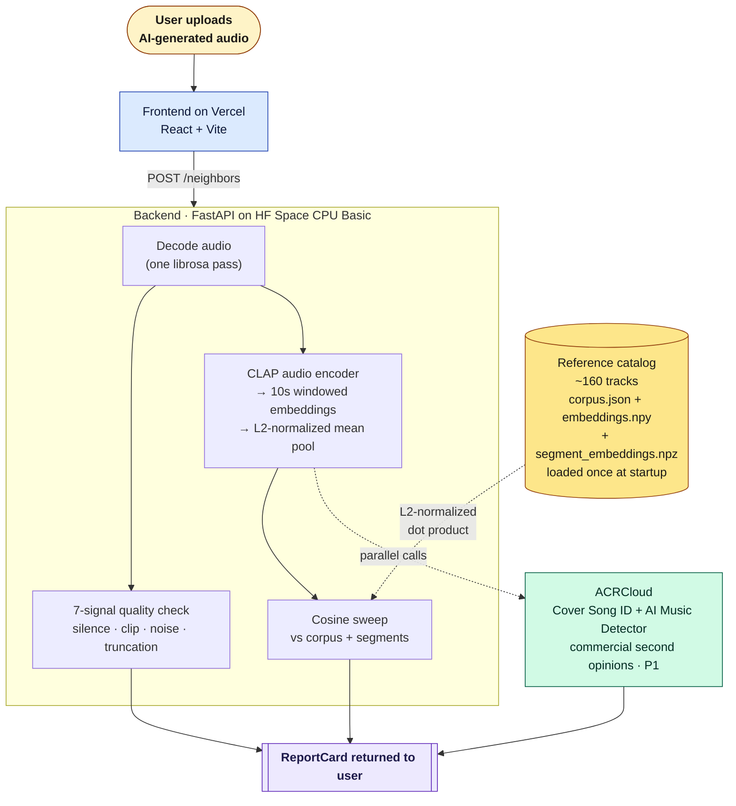

# Phase 4 implementation — PiedPiper rename + rights documentation

**For Codex. Read this file end-to-end, then apply the changes. The bulk of the work is verbatim content drops into specific files; the verification is `grep`.**

---

## Quick orientation

Phase 4 makes the codebase read as **PiedPiper** end-to-end (instead of the inherited "Soundcheck" branding) and adds a substantive top-level `README.md` that walks a 5–20 minute warm-intro reader through the architecture, technical choices, rights story, and "what I deliberately left out" framing.

**Implementation order: Phase 2 first, then Phase 4.** Both touch `backend/backend/api.py` (Phase 2 modifies `_load_corpus` + `/neighbors` + `/health`; Phase 4 swaps the `FastAPI(title=...)` one-token). Sequence them rather than run concurrent to avoid an avoidable merge.

Phase 4 stays parallelizable with **Phase 3** (frontend rewire) — different files entirely. Phase 3 can pick up while Phase 4 is in flight.

---

## Read first

1. **`factory/artifacts/LOCKED_DECISIONS.md`** — the rights, audience, and "deliberately left out" sections.
2. **`factory/artifacts/PROJECT_PLAN.md`** — Phase 4 section.
3. **`factory/artifacts/CLAUDE_UI_DESIGN_PROMPT.md`** — the Silicon Valley framing (one tagline at top, one Easter-egg at bottom). The README echoes this restraint.

---

## What this phase produces

| File | Action |
|---|---|
| `README.md` (top-level, new) | Create with the verbatim content in §1 below. |
| `quality-scorer/README.md` | Replace with verbatim content in §2. |
| `quality-scorer/index.html` | Change the `<title>` tag — one line. |
| `backend/backend/api.py` | Change `FastAPI(title="Soundcheck", ...)` to `FastAPI(title="PiedPiper", ...)`. One token. |
| `quality-scorer/src/components/Layout.jsx` and `Nav.jsx` | Replace header "Soundcheck" copy with "pied piper" (lowercase). Specifics in §3. |
| `quality-scorer/src/pages/AboutPage.jsx` | Swap any user-facing "Soundcheck" copy with "PiedPiper" or "pied piper" per the rule in §3. |
| `quality-scorer/src/pages/ScorerPage.jsx` | Same — swap any user-facing "Soundcheck" copy with "PiedPiper" or "pied piper". The current hero copy still references the old quality-scorer thesis; Phase 3 will fully rewrite this page against the new locked product shape, so for Phase 4 just remove the literal "Soundcheck" strings without rewriting product copy. |
| `quality-scorer/src/index.css` | Swap any "Soundcheck" string (most likely a comment header) for "PiedPiper". |
| `quality-scorer/src/lib/api.js` | Comment swap: the prod-URL hint (currently `https://<your-hf-username>-soundcheck.hf.space`) becomes `https://<your-hf-username>-piedpiper.hf.space`. Don't change any logic. |
| `factory/artifacts/PROBLEM_SUMMARY.md` | Prepend a Superseded banner; do NOT rewrite the body. Banner content in §4. |

The directory `quality-scorer/` stays named `quality-scorer/` — renaming to `frontend/` would touch Vercel config + Dockerfile + import paths for marginal benefit. The legacy name is acknowledged in the new frontend README.

---

## Verification

Run from repo root after applying all changes:

```bash
# 1. No user-visible "soundcheck" text in JSX, HTML, or top-level CSS/markdown.
#    Internal-subsystem references in code comments or CSS class names are OK
#    to leave (the inherited 7-signal pipeline IS the Soundcheck subsystem),
#    but user-facing JSX copy and the HTML/README must be clean.
grep -ri "soundcheck" \
  quality-scorer/index.html \
  quality-scorer/README.md \
  quality-scorer/src/pages \
  quality-scorer/src/components

# Expected: NO matches in any of the above. If something surfaces, decide:
#   - User-facing copy / brand reference → swap to PiedPiper / pied piper.
#   - Internal comment / class name → fine to leave, but move it out of a
#     JSX-visible string into an internal helper or comment so it doesn't trip
#     a future audit.

# 1b. Spot-check the lower-priority files separately (in case any literal
#     "Soundcheck" snuck in):
grep -i "soundcheck" quality-scorer/src/index.css quality-scorer/src/lib/api.js
# Expected: nothing user-visible. CSS class names with `soundcheck` substring
# are acceptable; comment headers are not.

# Note on the top-level README:
# The new top-level README (§1) intentionally retains one Soundcheck reference:
#   "...broken-output detection inherited from the prior Soundcheck signal pipeline."
# This is engineering-lineage documentation, not brand text. The 7-signal
# detector genuinely IS the inherited Soundcheck subsystem; naming it shows
# provenance rather than papering over it. The grep above does NOT scan the
# top-level README, so this line is unaffected by verification — by design.

# 2. Top-level README contains a Rights section:
grep -E "^## Rights" README.md

# 3. FastAPI title swap landed:
grep -n 'FastAPI(title=' backend/backend/api.py
# Expected: shows `title="PiedPiper"` (or whatever your refactored line reads).

# 4. PROBLEM_SUMMARY.md has the Superseded banner near the top:
head -20 factory/artifacts/PROBLEM_SUMMARY.md | grep -i "superseded"

# 5. Sanity check: existing tests still pass.
cd backend && pytest -q
```

---

## §1. New top-level `README.md` — verbatim content

Create `README.md` at the repo root with exactly this content:

````markdown
# PiedPiper

> *Find out if your AI-generated track resembles anything that's come before.*

PiedPiper is a deployed web app that takes an AI-generated music track (typically a Suno or Udio output) and returns the **top 3 closest real songs from a hand-curated catalog, each with a similarity percentage**, ranked highest first. If nothing crosses the similarity threshold, the headline reads **"Completely unique — this track doesn't sound like anything in our reference catalog."**

Two independent secondary signals from ACRCloud sit on the same report: a **Cover Song ID** check (does this resemble a known composition?) and an **AI Music Detector** result (is this AI-generated, and likely from which engine?). An inline track-quality status badge surfaces broken-output detection inherited from the prior Soundcheck signal pipeline.

A separate `/evaluation` page reports measured detector quality: `Recall@1`, `Recall@3`, `MRR`, a top-1 cosine score distribution on unrelated negatives, and named false-positive / false-negative examples with audio playback.

## A small note on the name

In the *Silicon Valley* pilot ("Minimum Viable Product"), Richard Hendricks first pitches Pied Piper as a music app — a tool for songwriters and composers to search whether their melody resembles anything that's come before. The investors laugh him out of the room and the show pivots Pied Piper to a compression algorithm. **PiedPiper-the-project is Richard's original pitch, ten years later, applied to AI-generated music.** The engineering is straight; the framing is a wink.

## Architecture



One decode pass feeds three jobs in parallel: a 7-signal quality check (the inherited broken-output detector), the CLAP windowed encoder, and the optional ACRCloud calls. All three results merge into a single ReportCard.

The catalog is built offline by `python -m backend.scripts.rebuild_corpus`, which reads `backend/catalog.yaml`, hits the iTunes Search API (Tier 1) and Jamendo CDN (Tier 2), runs windowed CLAP encoding on every track, and writes five files to `quality-scorer/public/corpus/`. The live backend reads those files at startup and serves them via `/neighbors`.

## Why these technical choices

**Audio embedding model: LAION-CLAP music-tuned 512-d** (`laion/larger_clap_music`). Apache-2.0, ~190 MB, CPU-friendly at ~1.5 s per encode, music-tuned. MERT would be marginally better on instrument-level discrimination but adds CPU latency for a gain that doesn't translate to this task. MuQ-MuLan is less production-tested. Classical baselines (chroma + MFCC, OpenL3, VGGish) are too coarse to discriminate AI soundalikes from genre-mates.

**Vector search: in-memory NumPy cosine sweep.** At ~160 tracks × 512 floats, a sweep is sub-millisecond. FAISS Flat becomes interesting at ~10k tracks; HNSW at ~100k. A vector DB would be misplaced complexity at this scale and would mask any L2-normalization bug upstream.

**Backend hosting: Hugging Face Space CPU Basic (free).** The audience knows what an HF Space is — that *itself* is the cultural signal. The 48-hour sleep is mitigated by a daily UptimeRobot ping to `/health`. Modal would be the migration target if cold starts ever degrade the reviewer experience; a paragraph at the bottom of the eval page names the cutoff.

**Track-length normalization: 10-second windows, L2-normalized mean pooling.** Catalog previews are 30 s (3 windows); uploaded queries are capped at 90 s (up to 9 windows). The response surfaces both `meanPooledSimilarity` (the headline rank) and `maxSegmentSimilarity` (local resemblance the mean would wash out). Comparing one arbitrary full-track truncation to a 30-second preview embedding would be wrong; the windowed-mean-pool protocol keeps both sides comparable.

**Single threshold (provisional `0.70`), recalibrated from negatives.** The multi-band verdict chip (`unique` / `related` / `similar` / `near-duplicate`) is gone — the percentage is the honest answer; the chip was a derived interpretation that invited "what does 'similar' mean?" debate. The only threshold that remains is the "Completely unique" cutoff, recalibrated from the observed top-1 cosine distribution on the unrelated negatives in the golden set.

**ACRCloud as two independent signals, not a composite verdict.** Cover Song ID asks "does this resemble a known composition?" — paired against our self-built CLAP retrieval. AI Music Detector asks "is this AI-generated, likely Suno?" — directly on-thesis for the audience. They answer different questions; collapsing them into one verdict misrepresents both. Both are P1, budget-gated behind ACRCloud's 14-day trial, with pre-cached responses for the eval set so the demo never breaks after trial expiration.

## Rights and catalog

The reference catalog is **a sampled demo set, not a production catalog**, split into two tiers:

**Tier 1 — recognizable hits via the iTunes Search API previews.** Audio is fetched once at ingest, embedded via CLAP, and discarded immediately. The deployed app never re-hosts Apple preview bytes. Apple Search API terms require: (a) preview audio is streamed not stored; (b) attribution and link-out to the iTunes Store on every Tier-1 match. Both are enforced in the UI via the `attribution_required` field in `corpus.json`.

**Tier 2 — breadth via MTG-Jamendo.** All Creative Commons licensed. Dataset metadata (track ID, genre tags) comes from the official MTG-Jamendo repo; audio streams from Jamendo's public CDN at ingest time, gets embedded, and is discarded the same way as Tier 1. Each Tier-2 match links out to the Jamendo track page.

**Productionizing this would mean indexing a licensed catalog** (the kind a vendor like Suno would have internally; the demo can't have it). That trade-off — and the resulting catalog incompleteness — is the dominant failure mode of the system, and is named explicitly on the `/evaluation` page.

## What I deliberately left out

- **No music generation.** That's Suno's job, not the scanner's.
- **No exact-recording fingerprinting** (Shazam-style). Different problem entirely; AI soundalikes rarely re-use bit patterns, so fingerprinting gives a near-zero hit rate against this workload.
- **No multi-band verdict chip.** The cosine percentage is the honest answer; the chip was a derived interpretation that invited "what does 'similar' actually mean?" debate without adding information.
- **No "copyright detector" framing.** Acoustic-similarity language only, never legal language. This is a risk scanner, not a copyright determination.
- **No user accounts or persistence.** Stateless demo. Uploaded audio is held in memory only for the duration of the encode.
- **No automation against Suno's web service.** ToS-violating, and the wrong signal for a Suno-adjacent demo.
- **No claim of full-catalog coverage.** ~160 tracks is a demo. The README and UI say so plainly.
- **No "powered by AI" badges** in the UI. The whole project is AI-adjacent — calling it out reads as overcompensating.
- **Always-on commercial APIs (paid plan).** ACRCloud runs trial-gated with cached responses for the eval set so the demo never fully breaks. Production would lock a paid plan.

## Evaluation

The `/evaluation` page reports the substance:

- **`Recall@1`, `Recall@3`, `MRR`** on a hand-built golden set of ~60 Suno generations targeting catalog seeds, plus 20–30 unrelated negatives (~80 tracks total).
- **A top-1 cosine histogram on the negatives set.** The dashed vertical line at the `0.70` threshold is where the distribution's tail thins; it's the noise floor justifying the "Completely unique" cutoff.
- **5 named false-positive + 5 named false-negative examples** with audio playback (query + retrieved track) and a one-sentence "why I think this happened" note per example. These move credibility more than any additional metric.
- **A short methodology paragraph** documenting the golden set construction.
- **A short limitations paragraph** naming the catalog size, single-generator (Suno only), no inter-rater agreement, and US-pop bias.

## Run it

### Prerequisites

- Python 3.11+
- Node 18+
- A clone of this repo

### Backend (FastAPI on local 8000)

```bash
pip install -e "backend/[runtime,ingest,dev]"
uvicorn backend.api:app --reload --port 8000
```

`/health` should return `ok: true` once CLAP finishes loading (~30 s cold start).

### Frontend (Vite on local 5173)

```bash
cd quality-scorer
npm install
npm run dev
```

### Rebuild the catalog

```bash
python -m backend.scripts.rebuild_corpus
# Writes corpus.json + embeddings.npy + segment_embeddings.npz + manifest.json + examples.json
# to quality-scorer/public/corpus/.
```

### Run the eval (Phase 6)

```bash
python -m backend.scripts.run_eval
# Writes eval.json + golden_set.json. The /evaluation page reads these at runtime.
```

## License

MIT. See `LICENSE`.

---

*Originally pitched to a confused VC in 2014. Probably more useful now.*
````

---

## §2. New `quality-scorer/README.md` — verbatim content

Replace `quality-scorer/README.md` with:

````markdown
# PiedPiper — frontend

React + Vite + Tailwind v4 — the upload flow, ReportCard (similarity-first), and `/evaluation` page.

> The directory is named `quality-scorer/` for legacy reasons (this codebase started as a separate quality scorer before pivoting to similarity). Renaming would touch Vercel config and import paths for marginal benefit; the directory name stays.

The backend lives at `../backend/` and exposes `POST /neighbors` (the similarity report) and `POST /analyze` (the inherited quality badge). Both are consumed by `src/lib/api.js`.

## Run

```bash
npm install
npm run dev      # http://localhost:5173
npm run build    # production bundle → dist/
npm run preview  # serve the built bundle
```

Set `VITE_API_URL` to the backend host:

- Dev: `http://localhost:8000` (in `.env.local`)
- Prod: the deployed HF Space URL (in `.env.production`)

## Structure

```
src/
  lib/
    api.js              # neighborsUpload + analyzeUpload; the only seam to the backend
    format.js, prng.js  # formatting + deterministic RNG helpers
  components/
    Nav.jsx, Layout.jsx, Hero.jsx
    DropZone.jsx, ExampleChips.jsx
    ReportCard.jsx                # Case A + Case B in one component
    SimilarityReport.jsx          # top-3 ranked rows + headline
    AcrCloudRow.jsx, SunoPill.jsx # two ACRCloud rows; rose tint when likely_source == "suno"
    QualityBadge.jsx              # inline badge + expandable 7-signal breakdown
  pages/
    ScorerPage.jsx       # landing — drop zone, examples, ReportCard
    EvaluationPage.jsx   # measured detector quality + named FP/FN examples
    AboutPage.jsx
```

The design tokens live in `tailwind.config.js`. The Suno-flare tokens (`--suno`, `--suno-soft`, `--suno-deep`) are only consumed by `SunoPill.jsx` and a small detector sigil in the footer — see `factory/artifacts/CLAUDE_UI_DESIGN_PROMPT.md` for the rules.

## Stack

React 18 + Vite + Tailwind v4 + Framer Motion (transitions only; no springs).
````

---

## §3. Specific text changes

### `quality-scorer/index.html`

Change the `<title>` tag from whatever it currently reads to exactly:

```html
<title>pied piper — find out if your AI-generated track resembles anything that's come before</title>
```

Also update the `<meta name="description">` tag content to:

```html
<meta name="description" content="PiedPiper is an acoustic-similarity scanner for AI-generated music. Upload a Suno or Udio track; see the top 3 closest real songs with a similarity percentage." />
```

### `backend/backend/api.py`

Change the FastAPI title (around line 99 in the current file):

```python
# Before:
app = FastAPI(title="Soundcheck", version=__version__, lifespan=lifespan)

# After:
app = FastAPI(title="PiedPiper", version=__version__, lifespan=lifespan)
```

If Phase 2's PR has already changed surrounding lines, just keep the spirit of the change: the `title=` keyword arg becomes `"PiedPiper"`. Don't touch anything else in `api.py`.

### `quality-scorer/src/components/Layout.jsx`

Replace any occurrence of the literal string `Soundcheck` with `pied piper` (lowercase, intentional — see the design prompt). If the file imports from a `Nav.jsx`, the wordmark probably lives in `Nav.jsx` instead; cover both. After your changes, this file should contain no "Soundcheck" string.

### `quality-scorer/src/components/Nav.jsx`

Same as `Layout.jsx`: replace `Soundcheck` with `pied piper` (lowercase). The wordmark and any nav-link text that referenced Soundcheck. If there's a SVG/logo path for an old Soundcheck mark, leave it but don't rename to a Pied Piper feather yet — the new feather glyph is Phase 3's job.

If either `Layout.jsx` or `Nav.jsx` doesn't exist yet (this is a new component scaffold), just don't create it as part of Phase 4. Phase 3 will create them with the right wordmark from the start.

### `quality-scorer/src/pages/AboutPage.jsx`

Swap user-facing strings only. The rule for case:

- Anywhere "Soundcheck" appears as a product/brand name in copy → `PiedPiper` (display-cap) or `pied piper` (lowercase, only if it appears in a wordmark / nav position).
- Anywhere "Soundcheck" appears as an internal-subsystem reference (e.g. "the legacy Soundcheck signal pipeline" or "inherited from the Soundcheck quality detector") — that's allowed to stay because the inherited 7-signal detector is genuinely the Soundcheck subsystem. But user-facing AboutPage copy is the brand surface; default to swap and only leave Soundcheck if it's clearly an internal-reference line.

After your changes, `grep -i "soundcheck" quality-scorer/src/pages/AboutPage.jsx` should either be clean or only show lines you've left intentionally as internal references.

### `quality-scorer/src/pages/ScorerPage.jsx`

This page still reflects the old "quality scorer" thesis (the headline asks if the track is technically sound, not whether it resembles existing songs). **Phase 3 will fully rewrite this page** against the locked product shape (top-3 similarity ranking, "Completely unique" headline, new ReportCard structure).

For Phase 4 — **don't rewrite product copy**. Just remove the literal "Soundcheck" strings (replace with "PiedPiper" or just drop the brand mention if the surrounding sentence works without it). Phase 3 will take care of replacing the page's actual content.

### `quality-scorer/src/index.css`

If there's a comment header naming "Soundcheck", swap it to "PiedPiper". If there are CSS class names with `soundcheck` in them, leave them — class names are internal structural identifiers, not user-facing. The grep rule below is case-insensitive on text, but CSS class names rarely show "Soundcheck" capitalized; if a literal Soundcheck token appears in a comment, swap it.

### `quality-scorer/src/lib/api.js`

Around line 5–8 there's a comment block hinting the prod URL pattern:

```javascript
//   - Dev (.env.local):       http://localhost:8000
//   - Prod (.env.production): https://<your-hf-username>-soundcheck.hf.space
```

Swap the second line to:

```javascript
//   - Prod (.env.production): https://<your-hf-username>-piedpiper.hf.space
```

No code changes. Comment only.

---

## §4. Superseded banner for `factory/artifacts/PROBLEM_SUMMARY.md`

Insert this block immediately after the closing `---` of the existing frontmatter (so it appears at the top of the rendered document, above the `# Problem Summary — PiedPiper` heading). Do not modify the body of the document; just prepend the banner.

```markdown
> **Superseded by [LOCKED_DECISIONS.md](LOCKED_DECISIONS.md) on 2026-06-09.**
>
> This document captures PiedPiper's original Understand-phase framing. Subsequent decisions — the verdict-chip removal, the three-signal ReportCard, the ACRCloud framing, the iTunes + Jamendo two-tier catalog, and more — live in `LOCKED_DECISIONS.md`. When this file conflicts with `LOCKED_DECISIONS.md`, the locked decisions win. This file is kept for narrative continuity and historical context; do not treat it as the current contract.

```

---

## When you're done

Return a short note (under 200 words):

1. Confirmation that the `grep` verification commands at the top of this file return clean (no user-visible "soundcheck"; the Rights header is present; the FastAPI title swapped; the Superseded banner is in place).
2. Confirmation that `cd backend && pytest -q` still passes (Phase 1 + Phase 2 tests, if Phase 2 is already in).
3. Anything you flagged or had to judgment-call on.

Do NOT modify:

- `factory/artifacts/*` (except `PROBLEM_SUMMARY.md`, and only the banner — no body changes)
- Anything else in `backend/backend/`, `backend/backend/scripts/`, or `quality-scorer/src/` that isn't named explicitly above
- Tests
- The corpus files under `quality-scorer/public/corpus/`

Phase 5 (ACRCloud integration) scaffolds next once Phase 2 + Phase 3 are landed.
